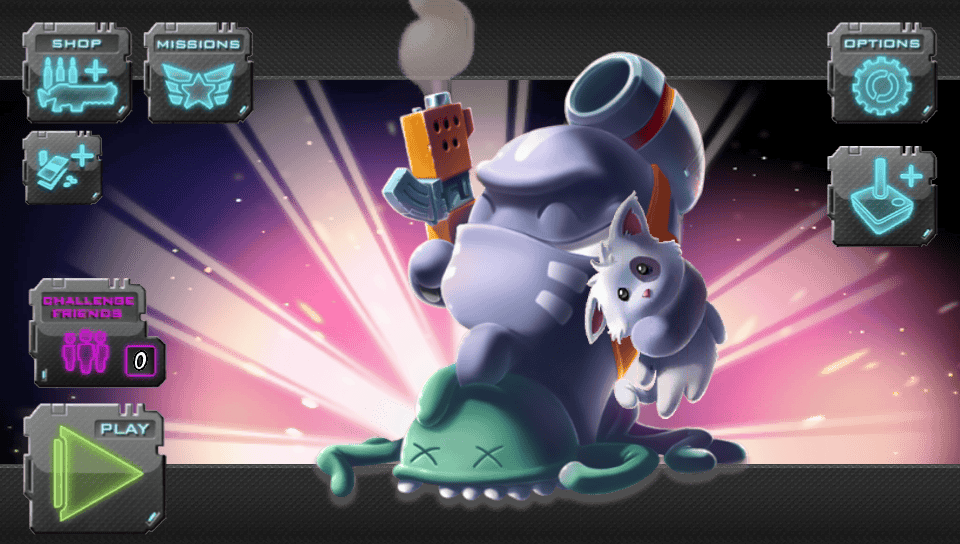
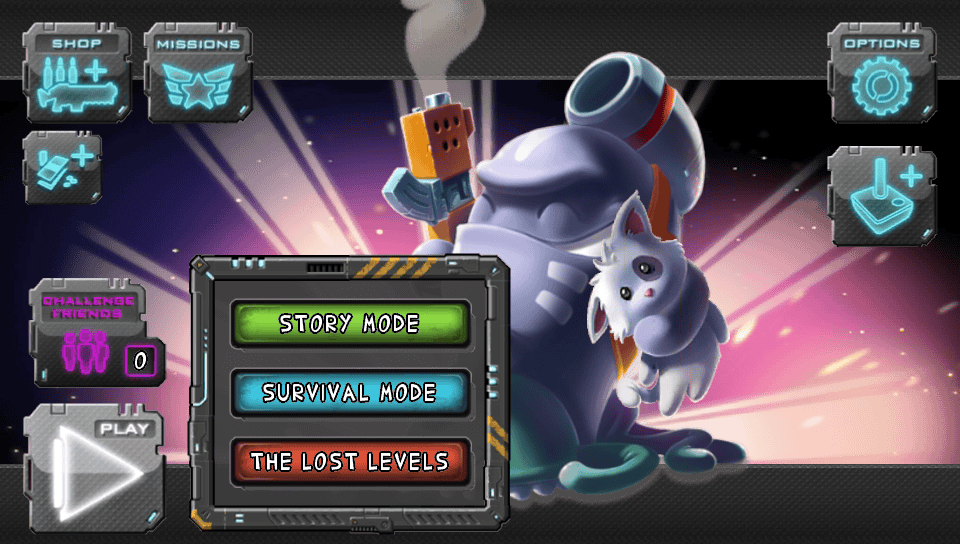
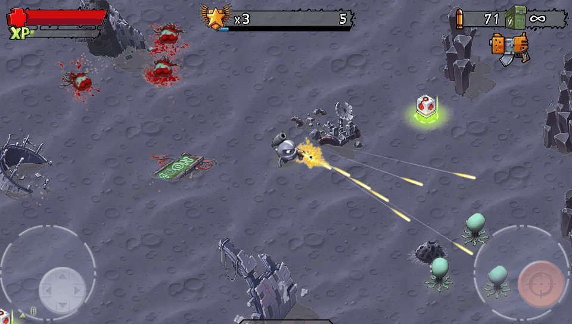
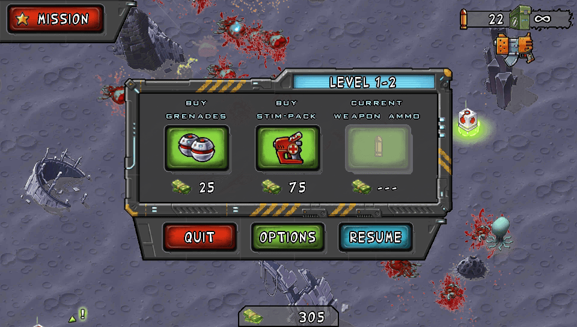

# Monster Shooter - PS Vita Port

A native PS Vita port of **Monster Shooter** (Gamelion, 2012), the top-down
twin-stick shooter where a kidnapped kitten is reason enough to clear a planet
of monsters. This runs the original ARMv7 Android binary through a so-loader,
with the game's own Claw Engine driving vitaGL underneath.

Playable start to finish: story mode, survival, shop and upgrades, with stereo
audio, the original cutscenes and real analog controls instead of the
on-screen sticks.

## Changelog

**v1.2**

- Cutscenes: the four original videos now play through `sceAvPlayer`, audio in
  sync; skip with Cross, Circle, Start or a tap on the screen
- On-screen touch sticks hide as soon as the analog sticks are used and come
  back on the first touch
- Frame pacing checked on hardware: a steady 60 fps in normal play

**v1.0** - first release.

- Runs the original `libClawNativeApp.so` via so-loader
- Stereo audio at 44100 Hz through `sceAudioOut`
- Physical controls: both analog sticks, face buttons and triggers
- Live Area assets taken from the game itself

## Official Game Download

Monster Shooter was delisted everywhere: it left the 3DS eShop between March
2018 and July 2020 in NA/EU, and on 26 May 2021 in Japan. The Android version
is likewise gone from the Play Store.

**This port does not include the game.** You need your own copy of the Android
APK. Nothing here will work without it.

## Setup Instructions For End Users

1. **Install kubridge.** Drop `kubridge.skprx` into `ur0:tai/` and add this
   line to `ur0:tai/config.txt`, under `*KERNEL`:

       ur0:tai/kubridge.skprx

   If your Vita reads its plugins from `ux0:tai/config.txt` instead, use that
   folder for both. Reboot the Vita.

2. **Install `libshacccg.suprx`** if you have not already. vitaGL compiles its
   shaders at runtime and the port will not render a single frame without it.
   Use [ShaRKBR33D](https://github.com/Rinnegatamante/ShaRKBR33D) to extract it
   from your console's own firmware.

3. **Run the setup tool.** Unzip the release, put your legally obtained
   Monster Shooter APK in the same folder, and double-click
   `MonsterShooterSetup.exe`. It finds the APK on its own and checks it.

   Then tell it where the Vita is:

   - **Over Wi-Fi** - open VitaShell on the Vita and press SELECT. It shows an
     address like `ftp://192.168.1.23:1337`: type those numbers in.
   - **Over USB** - turn on USB mode in VitaShell and choose the Vita's drive.

   Press **Prepare my Vita**. The tool warns you if `kubridge` or
   `libshacccg.suprx` are missing - the two usual causes of a black screen -
   sends the game data and the VPK, and checks every file after it arrives. If
   the Wi-Fi drops halfway, press the button again: what already arrived is
   kept, and only the rest is sent.

   The program is not signed, so Windows may show *"Windows protected your
   PC"*. Click **More info**, then **Run anyway**.

   On macOS or Linux, run `python3 extras/scripts/setup_gui.py` instead - it is
   the same program, and needs a Python that includes tkinter.

4. **Install the VPK.** In VitaShell, go to `ux0:data/` and press X on
   `monstershooter.vpk`. Then launch the game.

### Doing it by hand

If you would rather not use the tool, the command-line version does the
extraction and nothing else:

    python3 extras/scripts/extract_apk.py monster_shooter.apk

It writes a `monstershooter/` folder. Copy it to your Vita so that you end up
with `ux0:data/monstershooter/libClawNativeApp.so` and the rest alongside, then
install `monstershooter.vpk` with VitaShell.

## Controls

| Vita | Action |
|---|---|
| Left stick | Move |
| Right stick | Aim and fire |
| R / R1 | Fire |
| Square | Throw grenade |
| Triangle | Use health kit |
| L / L1 | Weapon boost |

| Cross / Circle / Start or a tap | Skip a cutscene |

The on-screen touch sticks disappear as soon as you use the analog sticks and
come back the moment you touch the screen. They are never switched off - the
engine reads its input through them - only their quads are left out of the HUD
draw (`hud_filter` in `source/dynlib.c`).

## Build Instructions For Developers

You need a **softfp** VitaSDK: the Android `.so` is softfp, and a hardfp
toolchain will link but misplace every float argument.

You also need a current **vitaShaRK** installed into that SDK. vitaGL is a
submodule here and tracks upstream, and upstream calls
`shark_set_shader_association_path`, which older vitaShaRK builds lack: the
link fails with an undefined reference to it. Build vitaShaRK at `df24065` or
later from [Rinnegatamante/vitaShaRK](https://github.com/Rinnegatamante/vitaShaRK)
with `make install`, using the same softfp toolchain.

    git clone --recursive <this repo>
    cd <this repo>
    cmake -S . -B build -DCMAKE_BUILD_TYPE=Release
    cmake --build build -j8

`build/monstershooter.vpk` is the result. Build with `-DCMAKE_BUILD_TYPE=Debug`
for the verbose loader log, written to `ux0:data/monstershooter/log.txt`.
FalsoJNI and so_util print to the debug console instead - that is where a
missing Java method shows up, which is how the cutscene hook was found. Catch
it over the network with [PrincessLog](https://github.com/CelesteBlue-dev/PSVita-RE-tools/tree/master/PrincessLog).

Live Area assets must be **8-bit colormap** PNGs (run them through `pngquant`).
With RGBA truecolor, VitaShell rejects the package with error `0x8010113D`.

## Known Issues

- **Occasional frame drops with many enemies on screen.** Normal play holds
  60 fps; the CPU already runs at the maximum userland clocks.

## Screenshots

| | |
|---|---|
|  |  |
|  |  |

Captured from the framebuffer at the Vita's native 960x544.

## Development Notes

This port was developed with the assistance of an LLM, used
for reverse engineering a closed-source binary and for implementing parts of the
loader.

Every finding here was confirmed on real hardware rather than assumed. The
things that mattered - the black gameplay, the stuck story loading, the audio
stutter, the controls - were each isolated with a reproduction first and fixed
at the cause. That said, as with any project of this kind, unexpected issues and
edge cases may still be present.

## Credits

- **TheFloW** for the original Android loader research the whole scene rests on
- **Rinnegatamante** for [vitaGL](https://github.com/Rinnegatamante/vitaGL) and
  ShaRKBR33D
- **Volodymyr Atamanenko** (gl33ntwine) for
  [soloader-boilerplate](https://github.com/v-atamanenko/soloader-boilerplate),
  FalsoJNI and so_util
- **The Vita homebrew community**, whose write-ups on so-loader ports made every
  dead end shorter than it would have been
- **Gamelion Studios** for making the game in the first place

## Disclaimer

This is an unofficial, non-commercial fan project. It is **not affiliated with,
endorsed by, or associated with Sony Interactive Entertainment or Gamelion
Studios** in any way. PlayStation and PS Vita are trademarks of Sony Interactive
Entertainment. Monster Shooter and all related assets are the property of their
respective owners.

No game content is distributed here. This repository contains only the loader
and the tooling to run the game from a copy you already own.

## License

MIT, matching the boilerplate this is built on. It covers the loader in this
repository and nothing else: the game's own assets and binaries belong to their
respective owners and are not distributed here.
